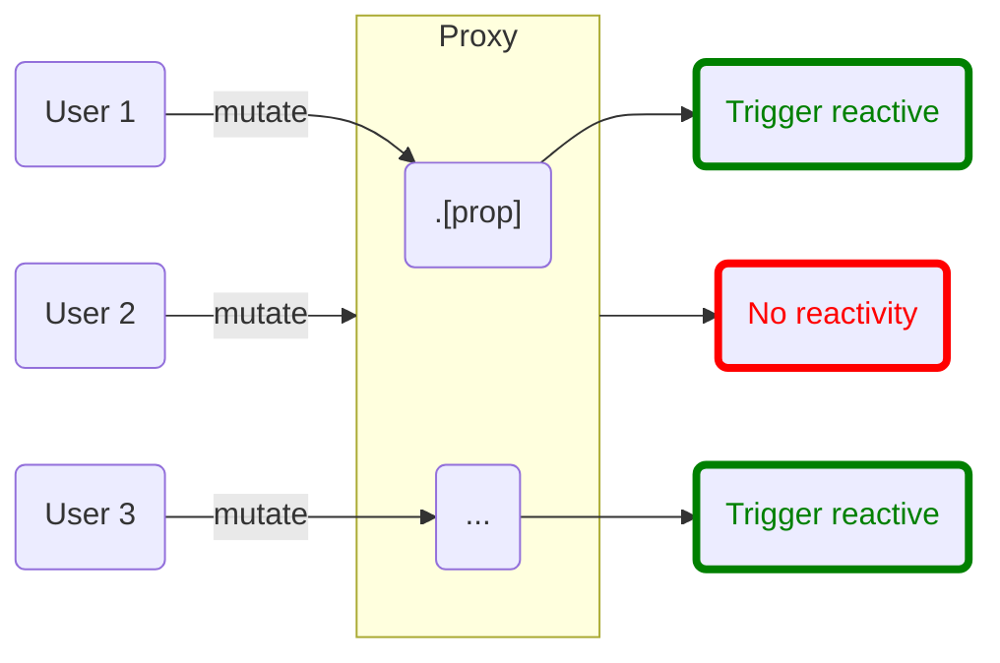
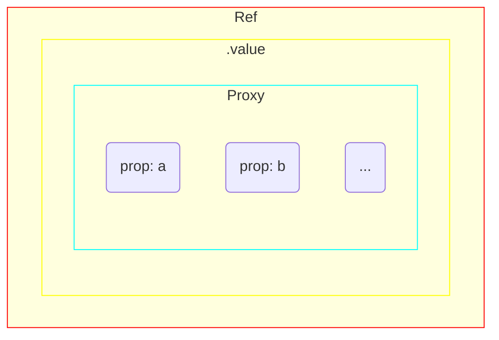

# reactive

Đây là một cách khác để định nghĩa reactive data (state). Khác với `ref()` sẽ thực hiện gói giá trị vào một `object` đặc
biêt - `Ref`, `reactive()` sẽ biến `object` trở nên reactive.

## API

<!--@include: @/api/reactive.md{2,}-->

## Đối tượng Reactive `Proxy`

Khác với `ref()` sẽ sử dụng của `object`, `reactive()` sẽ sử
dụng [JavaScript Proxy](https://developer.mozilla.org/en-US/docs/Web/JavaScript/Reference/Global_Objects/Proxy) và có
hành vi y như một `object` thông thường. Vì vậy, đối với `reactive()` thì sẽ không cần sử dụng thông qua `.value`. Thay
vào đó, có thể truy cập và thay đổi bất kỳ thuộc tính nào của đối tượng và vẫn sẽ reactive. Sơ đồ bên dưới sẽ
minh họa về đối tượng reactive `Proxy` rõ hơn.



Dưới đây là ví dụ mở rộng cho việc truy cập và thay đổi giá trị của reactive data (state):

::: code-group
<<< @/demo/reactive-interaction/App.vue
:::

<DemoBlock>
<ReactiveInteraction/>
</DemoBlock>

Khi nhấn nút, gọi `reset()` và xóa dữ liệu của `data.input`. Có thể thấy, do đã kích hoạt reactive nên Vue đã render lại
thẻ `<div/>` có chứa nội dung của `data`.

Với `Proxy`, Vue có thể can thiệp hành vi truy cập và thay đổi của toàn bộ các thuộc tính trong `object` mà vẫn kích
hoạt reactive.

## Deep reactivity

Tương tự `Ref`, `Proxy` tạo bởi `reactive()` cũng có tính phản ứng sâu (deep reactivity). Thực tế, khi cung cấp
cho `ref()` dữ liệu không phải kiểu nguyên thủy, `ref()` sẽ sử dụng `reactive()` để tạo ra `Proxy` cho dữ liệu đó. Sau
đó, nó sẽ gói `Proxy` bằng `Ref`. Tức là giá trị trả về sẽ là một đối tượng `Ref` có `.value` là một `Proxy`.



:::info THÔNG TIN
Vì thế, có thể nói `reactive()` cung cấp deep reactivity cho `ref()`.
:::

### Shallow reactivity

`shallowReactivity` là phiên bản `reactive()` đã tắt deep reactivity đi. Tại đây, chỉ có các thuộc tính ở root-level mới reactive. Giả sử với dữ liệu bên dưới:
```js
const obj = {
  name: 'Car',
  detail: {
    color: 'red'
  }
}
```

Nếu thay đổi `name` hoặc `detail` thì sẽ reactive. Tuy nhiên nếu thay đổi `detail.color` thì sẽ không reactive. Xem thêm ví dụ minh họa bên dưới:

::: code-group
<<< @/demo/reactive-shallow/App.vue
:::

<DemoBlock>
<ReactiveShallow/>
</DemoBlock>

<script>
import {default as ReactiveInteraction} from "../demo/reactive-interaction/App.vue";
import {default as ReactiveShallow} from "../demo/reactive-shallow/App.vue";
</script>