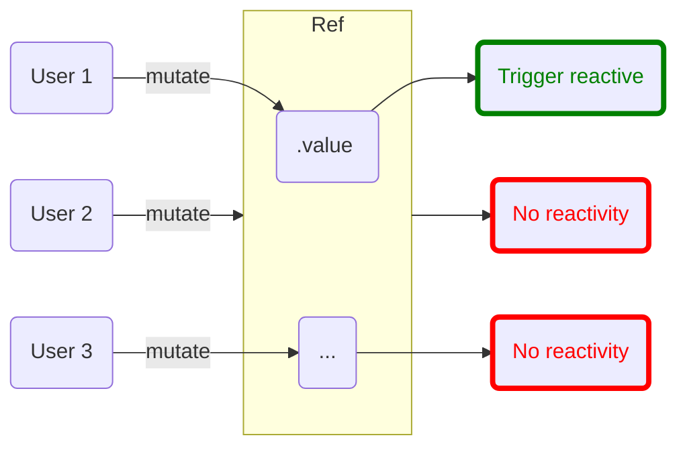

# ref

Đây là cách được khuyến khích sử dụng để tạo ra một reactive data (state) và có thể được sử dụng trong mọi trường hợp.

## API

<!--@include: @/api/ref.md{2,}-->

## Đối tượng `Ref`

Vue 3 sử dụng đối tượng `Ref` để xây dựng hệ thống reactivity. Đối tượng này sẽ có một property cần chú ý nhất chính
là `.value` chứa giá trị của reactive data (state). Khi muốn thực hiện thay đổi giá trị của reactive data (state), cần
phải thay đổi giá trị của `.value`. Sơ đồ bên dưới sẽ minh họa về đối tượng `Ref` rõ hơn.




Dưới đây là ví dụ mở rộng cho việc truy cập và thay đổi giá trị của reactive data (state):

::: code-group
<<< @/demo/ref-interaction/App.vue [&lt;script setup&gt;]
<<< @/demo/ref-interaction/Setup.vue [setup()]
:::

<DemoBlock>
<RefInteraction/>
</DemoBlock>

Khi nhấn nút, gọi `reset()` và xóa dữ liệu của `input`. Có thể thấy, dữ liệu của `Ref` nằm ở `.value` nên muốn lấy hoặc
gán dữ liệu cho `input`, cần phải thực hiện thông qua `.value`.

:::warning LƯU Ý
Khi sử dụng `Ref` trong phạm vi Composition API, bắt buộc phải sử dụng `Ref` thông qua `.value`.
:::

Trong JavaScript, không có cách nào phát hiện việc truy cập hoặc thay đổi một biến thô (biến chứa giá trị có kiểu nguyên
thủy). Tuy nhiên, có thể can thiệp vào hoạt động get set của thuộc tính đối tượng bằng cách sử dụng getter và setter.
Nhờ đó, thuộc tính `.value` sẽ cho phép Vue phát hiện khi nào `Ref` bị truy cập hoặc thay đổi.

Tuy nhiên, sẽ không cần phải sử dụng thông qua `.value` trong các trường hợp dưới đây:

* Đã bị unwrap (sẽ được đề cập chi tiết ở phần **Nâng cao**)
* Sử dụng trong template
* Sử dụng trong Option API sau khi đã return từ `setup()`

## Deep reactivity

`Ref` có thể được dùng cho bất kỳ kiểu dữ liệu gì, từ nguyên thủy cho tới `object`, `array` hay kể cả `Map`. Đồng
thời, `Ref` sẽ làm cho dữ liệu của nó có deep reactivity. Tức là Vue sẽ phát hiện được thay đổi khi
thay đổi `object` hay `array` có thuộc tính lồng nhiều tầng.

### Đối với `object`

Ở phiên bản tiền nhiệm, Vue không thể phát hiện việc thêm hoặc xóa một thuộc tính cho một đối tượng. Để làm điều đó, sẽ
cần sử dụng một số helper như `$get`, `$set`.

```js
var vm = new Vue({
  data: {
    a: 1
  }
})
// `vm.a` is now reactive

vm.b = 2
// `vm.b` is NOT reactive
```

Tuy nhiên ở Vue 3, sẽ không cần sử dụng bất kỳ một helper nào. Hãy xem ví dụ bên dưới:

::: code-group
<<< @/demo/ref-deep-object/App.vue [&lt;script setup&gt;]
<<< @/demo/ref-deep-object/Setup.vue [setup()]
:::

<DemoBlock>
<RefDeepObject/>
</DemoBlock>

Khi nhấn nút, thực hiện thêm/xóa thuộc tính của 'deep'. Sau đó, sẽ render lại `<div/>` do `deep` đã thay đổi.

### Đối với `array`

Tương tự `object`, tại Vue 2, sẽ có một số trường hợp không thể phát hiện thay đổi trong `array`, bao gồm:

* Set trực tiếp một thành phần bằng index

```js
vm.items[index] = newValue
```

* Thay đổi độ dài của `array`

```js
vm.items.length = newLength
```

Đối với trường hợp đầu tiên, cũng cần phải sử dụng `$set`. Trường hợp sau sẽ cần sử dụng `splice()`. Tuy nhiên ở Vue 3,
sẽ không cần sử dụng các hàm đã đề cập mà có thể truy cập trực tiếp như ví dụ sau:

::: code-group
<<< @/demo/ref-deep-array/App.vue [&lt;script setup&gt;]
<<< @/demo/ref-deep-array/Setup.vue [setup()]
:::

<DemoBlock>
<RefDeepArray/>
</DemoBlock>

:::danger CẢNH BÁO
Vì lý do trên, `$get` và `$set` đã bị xóa bỏ tại Vue 3.
:::

### Shallow reactivity

Deep reactivity là một tính năng rất hữu dụng, tuy nhiên nó cũng sẽ gây ra vấn đề về hiệu năng khi phải truy vết một dữ
liệu có cấu trúc rất phức tạp. Trong những trường hợp này, có thể tắt khả năng deep reactivity để tối ưu hóa hiệu năng
cho chương trình.

Có thể sử dụng `shallowRef()` để tắt deep reactivity. `shallowRef()` sẽ có cách thức sử dụng và hoạt động y hệt `ref`.
Thay vào đó, hàm sẽ chỉ trả về một Ref chỉ có tính reactive tại `.value`. Tức là chỉ khi thay đổi `.value`, khi đó,
reactive mới xảy ra. Xem thêm ví dụ bên dưới:

::: code-group
<<< @/demo/ref-shallow/App.vue [&lt;script setup&gt;]
<<< @/demo/ref-shallow/Setup.vue [setup()]
:::

<DemoBlock>
<RefShallow/>
</DemoBlock>

<script>
import {default as RefInteraction} from "../demo/ref-interaction/App.vue";
import {default as RefDeepObject} from "../demo/ref-deep-object/App.vue";
import {default as RefDeepArray} from "../demo/ref-deep-array/App.vue";
import {default as RefShallow} from "../demo/ref-shallow/Setup.vue";
</script>
